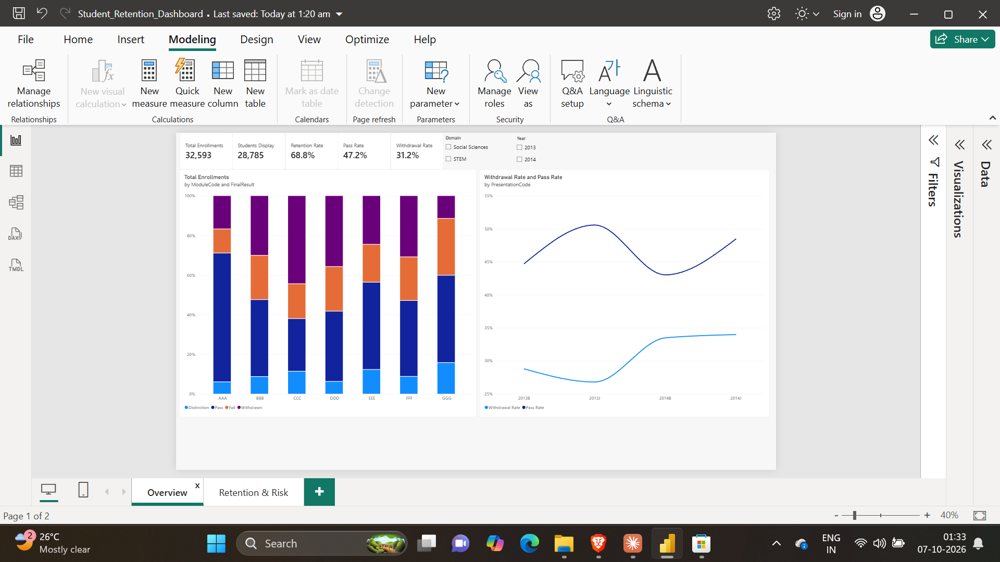
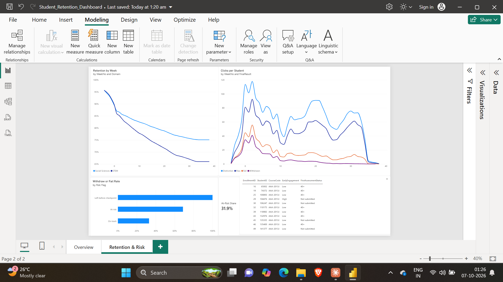
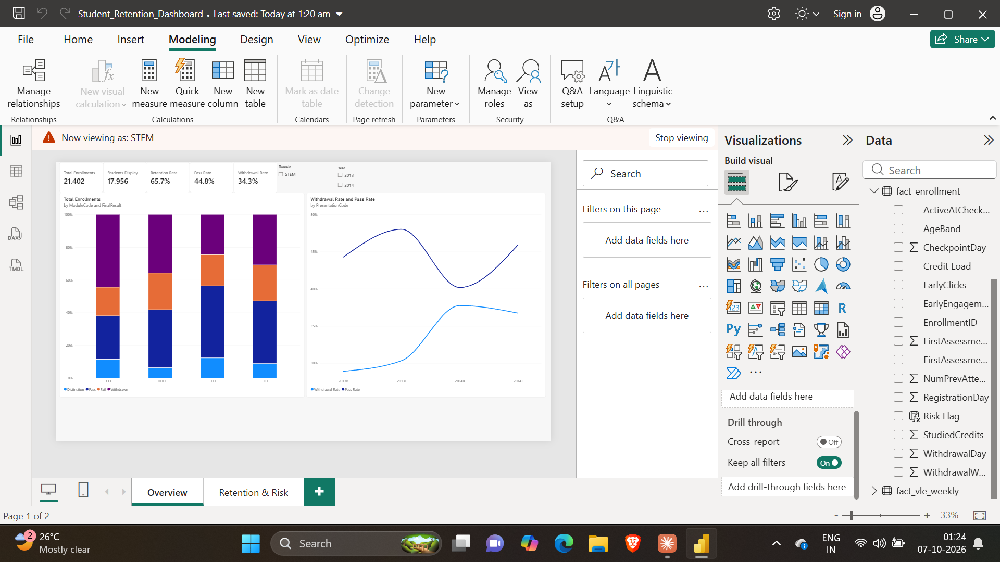

# Student Retention Dashboard (Power BI)

I built this to answer a simple question: which online students drop out, when, and could we have spotted them early?

The data is the Open University Learning Analytics Dataset. It has 32,593 course enrolments from 28,785 students across 7 modules and 4 intakes (Feb and Oct, 2013 and 2014).

## What I found

About 31% of enrolments end in withdrawal, and it got worse over time. The Oct 2013 intake lost 26.8% of students; the Oct 2014 intake lost 34%.

Most students who leave do it early. More than half of all withdrawals happen before week 5, and around 8% of students withdraw before the course even starts.

STEM modules lose more students than Social Sciences (34.3% vs 25.1%). Module CCC is the worst at 44.5%.

Engagement tells the story early. Students who end up passing are much more active on the learning platform from the very first week, while students who later withdraw go quiet within a few weeks.

I used this to build a simple early-warning flag at each course's first assessment: a student is flagged if they're in the bottom 25% for activity in their course, or didn't submit / didn't pass the first assessment. It flags about 32% of active students, and 69% of those went on to fail or withdraw, compared with 33% of everyone else. So it's not perfect, but it roughly doubles the hit rate for whoever has to make the follow-up calls.

## How I built it

**Python (pandas)** - `01_data_cleaning.ipynb`
Cleaned the 7 raw tables, including 10.6 million click records. Along the way I found and fixed a few data problems: a typo in the deprivation band ("10-20" instead of "10-20%"), 93 withdrawn students with no withdrawal date, and 9 students marked as failed who also had a withdrawal date. I reshaped everything into a star schema (3 fact tables, 5 dimension tables) and checked that row counts and total clicks matched the source exactly.

**SQL** - `02_sql_checks.ipynb`
Re-checked the main numbers in SQL (SQLite) to make sure they agreed with Python: orphan keys, headline KPIs, a module ranking with RANK(), and intake-over-intake change with LAG().

**Power BI**
- Power Query: split the presentation code into year and intake, and grouped study credits into bands
- Data model: star schema with one-to-many relationships
- DAX: 22 measures, including a week-by-week retention curve (using TREATAS and a cumulative count) and comparisons against the overall average with REMOVEFILTERS
- Row-level security: separate roles for STEM and Social Sciences

## Files
- `01_data_cleaning.ipynb` - cleaning and modelling in Python
- `02_sql_checks.ipynb` - SQL validation
- `my_data_clean/` - the 8 tables loaded into Power BI
- `DAX_measures.txt` - all the DAX
- `Student_Retention_Dashboard.pbix` - the report

## Data source
Kuzilek, J., Hlosta, M. & Zdrahal, Z. (2017). Open University Learning Analytics dataset. Scientific Data 4, 170171. https://doi.org/10.1038/sdata.2017.171 (CC BY 4.0)
